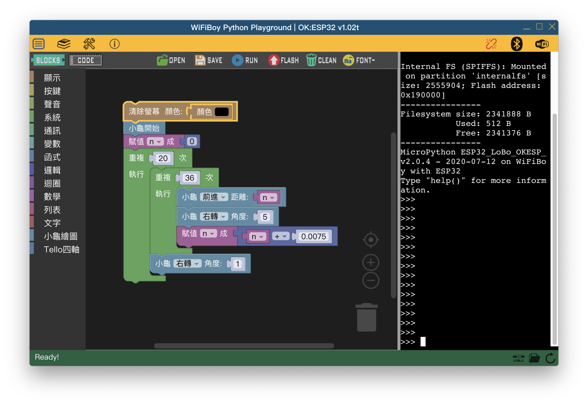

# MicroPython Playground for OK:ESP32 Dev Console

(Traditional Chinese Version v1.02tw)
(Other language supports coming soon...)

MicroPython Playground integrates Google Blockly, CodeMirror editor and Xterm.js with NW.js/Vue.js to build a REPL IDE for MicroPython developers.

<p align=center>
	
</p>

To start:
```bash
$ npm install
```
To develop:
```bash
$ npm run dev
```
To build for production:
```bash
$ npm run build
```
Use Desktop App :
```bash
$ cd dist
$ nw .
```


